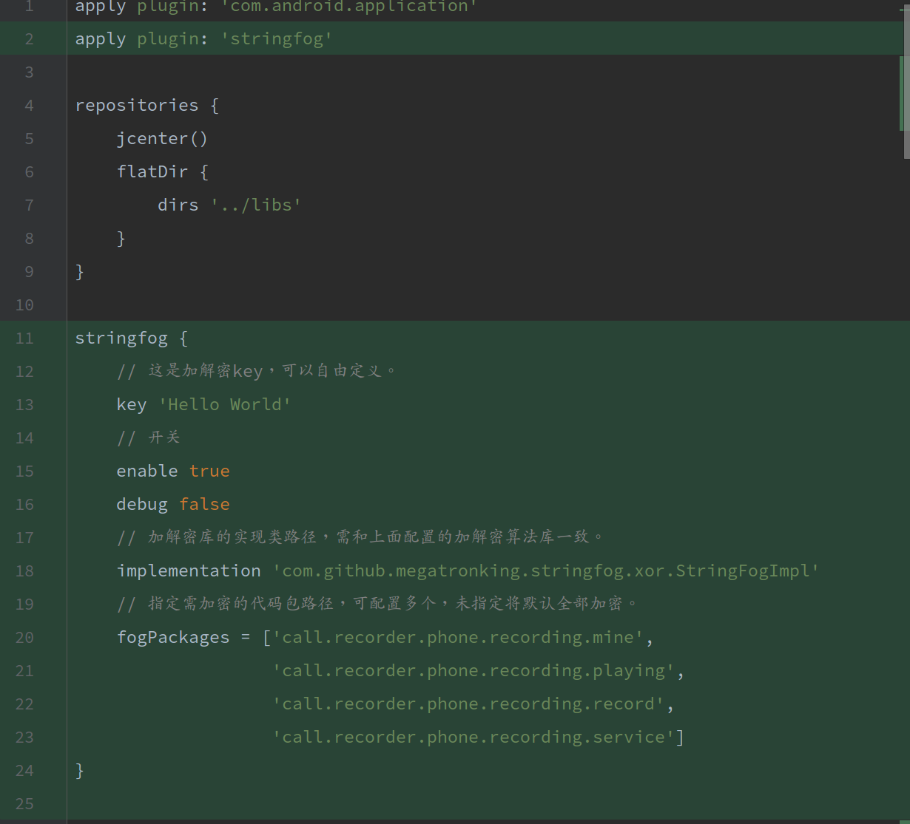

### 关于StringFog
对于字符串加密的处理，一般来说有两种思路。

1、在开发阶段开发者使用加密后的字符串然后手动调用解密。这无疑是最简单的方式，不过维护性差，工作量大，而且对于应用中成千上万的字符串如果全部加密人工耗时巨大。

2、编译后修改字节码，动态植入加密后的字符串并自动调用解密。这是最智能的方式，也不影响正常开发，不过实现起来稍有难度。

#### 一.加密原理

&emsp;&emsp;StringFog用的就是第二种。先说关于加密方式，由于考虑到性能和实现问题，其默认使用的加密是对称加密，用Base64 + XOR算法实现的。

关于上面那些高大上的名词，我下面简单解释一下：

XOR算法就是异或算法，原理就是异或运算。举个栗子：

```java
例1：基本异或运算
a = 10;                         // 1 0 1 0
b = 7;                          // 0 1 1 1
c = a^b;//c = 13;               // 1 1 0 1
```

```java
例2：利用异或运算，在只定义2个对象的情况下，交换这2个对象的值
void swap(int a,int b){
    a=a^b;         
    b=b^a;           
    a=a^b;
}
```
其实例2中的用法和对称加密的原理是一样的。下面来看一下加密的方法：这里通过对待加（解）密数据与一个字符串循环异或达到简单加（解）密的处理，代码如下：
```java
private static byte[] xor(byte[] data, String key) {
    int len = data.length;
    int lenKey = key.length();
    int i = 0;
    int j = 0;
    while (i < len) {
        if (j >= lenKey) {
            j = 0;
        }
        data[i] = (byte) (data[i] ^ key.charAt(j));
        i++;
        j++;
    }
    return data;
}
```

加密时对数据进行异或得到加密数据，解密时对数据再次进行异或得到解密数据。同时考虑到字符编码的特性，需要使用Base64做编（解）码处理：
```java
public static String encode(String data, String key) {
    return new String(Base64.encode(xor(data.getBytes(), key), Base64.NO_WRAP));
}

public static String decode(String data, String key) {
    return new String(xor(Base64.decode(data, Base64.NO_WRAP), key));
}
```
这样，既解决了字符编码的问题，又解决了加解密的问题（注意Base64严格意义上来说并非属于加密算法），而且在性能上又得到了可靠的保证。以上，就是StringFog默认加密方法的加密原理。

#### 二.实现原理

加密方式说完了，但是这个加密具体在什么时机执行，是如何操作的呢？据解释是说：对编译后Dex前的字节码文件进行加密操作。而且对此有强大的ASM包可以使用，下面我们来看下实现。

主要实现是基于Gradle Android的transform机制。

使用Gradle进行Android项目编译和打包时，为了提供更好的自定义任务操作，Gradle Android插件提供了强大的transform机制，可以对字节码文件和资源文件做自定义操作。比如进行Jar包合并、MultiDex拆分、代码混淆等都是通过这种机制来实现的。执行编译或者打包时能够看到如下任务流：
```java
app:transformClassesWithJarMergingForDebug
app:transformClassesWithMultidexlistForDebug
app:transformClassesWithDexForDebug
```
执行这些任务，会在build/intermediates/transforms目录下看到相应的transform文件夹，具体原理不细说了，感兴趣的自行研究。
所以，我们可以通过自定义transform操作，来对字节码文件使用ASM库进行改写。Gradle Android插件也提供了相应的API给我们进行此类扩展。
```java
def android = project.extensions.android
android.registerTransform(new StringFogTransform(project))
```
这两行代码是Groovy语言，自定义Gradle插件都会用到，相比Java语言更加简洁和易操作。
第一行代码是获取Android插件的Extension，对应于我们常见的build.gradle脚本里的这种：
```java
android {
    ...
}
```
对应的类是com.android.build.gradle.AppExtension，其继承了父类的registerTransform方法，意思就是注册一个transform处理类，这里我们注册的是StringFogTransform。

```java
class StringFogTransform extends Transform {

      private static final String TRANSFORM_NAME = 'stringFog'

      @Override
      String getName() {
        return TRANSFORM_NAME
      }

      @Override
      Set<QualifiedContent.ContentType> getInputTypes() {
        return ImmutableSet.of(QualifiedContent.DefaultContentType.CLASSES)
      }

}
```

所有的自定义的处理类都必须继承Transform类，同时需要复写相应的几个方法。
首先，定义Transform的名字，我们使用项目的名字stringFog。
其次，定义输入类型，一共有两种，分别是CLASSES和RESOURCES，我们希望操作的是字节码，所以使用CLASSES。
这样就自动创建并加入了名为```javatransformClassesWithStringFogForvariant```的任务，其中variant的任务，其中{variant}指的是buildTypes，一般为Debug或者Release。
Transform还有几个待实现的方法，主要定义作用域和模式，这里略过不细说，重点来看一下transform方法的实现。
```java
void transform(TransformInvocation transformInvocation) throws TransformException, InterruptedException, IOException {
  def dirInputs = new HashSet<>()
  def jarInputs = new HashSet<>()

  // Collecting inputs.
  transformInvocation.inputs.each { input ->
      input.directoryInputs.each { dirInput ->
          dirInputs.add(dirInput)
      }
      input.jarInputs.each { jarInput ->
          jarInputs.add(jarInput)
      }
  }

  // transform classes and jars
  ...
}
```
需要transform的文件有两类。一类是当前项目Java文件编译后的class字节码文件，路径存放在directoryInputs属性中；一类是通过依赖引用的jar(aar)包，路径存放在jarInputs属性中。我们将其遍历出来放入我们定义的Set集合中，方便后续操作。
在获取到classes和jars的文件路径后，我们就可以通过ASM库来修改字节码文件了，分别调用了下面两个方法：
```java
StringFogClassInjector.doFog2Class(fileInput, fileOutput, mKey)
StringFogClassInjector.doFog2Jar(jarInputFile, jarOutputFile, mKey)
```
其中mKey就是我们指定的加密key了。

实现原理就介绍到这里为止，再往下说就是Gradle Android 关于ASM库相关的处理了，使用的是ClassVisitor来操作字节码文件然后重新写入，这里就不多讲了，有兴趣的可以了解一下。

#### 三.实际使用情况

我在CallRecorderPlus项目中拉分支并将其运用到分支项目中;主要引入方式如下：

在根目录build.gradle中引入插件依赖。
```java
buildscript {
    repositories {
        jcenter()
    }
    dependencies {
        ...
        classpath 'com.github.megatronking.stringfog:gradle-plugin:2.1.0'
        // 选用加解密算法库，默认实现了xor和aes-cbc两种简单算法，也可以使用自己的加解密库。
        classpath 'com.github.megatronking.stringfog:xor:1.1.0'
    }
}
```

在app或lib的build.gradle中配置插件。
<div align="center">
   
</div>

在app或lib的build.gradle中引入加解密库依赖。
```java
dependencies {
      ...
      // 这里要和上面选用的加解密算法库一致，用于运行时解密。
      compile 'com.github.megatronking.stringfog:xor:1.1.0'
}
```
然后编译relase版本就可以了。加解密的字符串明文和暗文会自动生成mapping映射文件，位于outputs/mapping/stringfog.txt，我之前指定了4个需要加密的地址，其中字符串明文暗文内容如下：
```
stringfog key : Hello World
stringfog impl: com.github.megatronking.stringfog.xor.StringFogImpl

[call.recorder.phone.recording.mine.AboutActivity]
- -> ZQ==
201907221419 -> elVdVV8XZV1DWFVx
has_new_version_code -> IAQfMwFFIDAECRY7DAMCMEM4Cxc=
rated_about -> OgQYCQt/Ng0dGRA=
issue_about -> IRYfGQp/Ng0dGRA=
updated_about -> PRUIDRtFMzATDgs9EQ==
```

以上是全部关于stringfog默认加密方式的使用。该项目也支持拓展加密算法与加密行为，感兴趣的话可以了解一下。
最后說一下关于编译版本的时间，引入该字符串加密工具在CallRecorderPlus项目中加密指定目录下字符串编译司时间为4m34s，引入之前编译时间在1分钟内，该结果仅供参考。

---------------------
本文参考：https://blog.csdn.net/megatronkings/article/details/63252266
