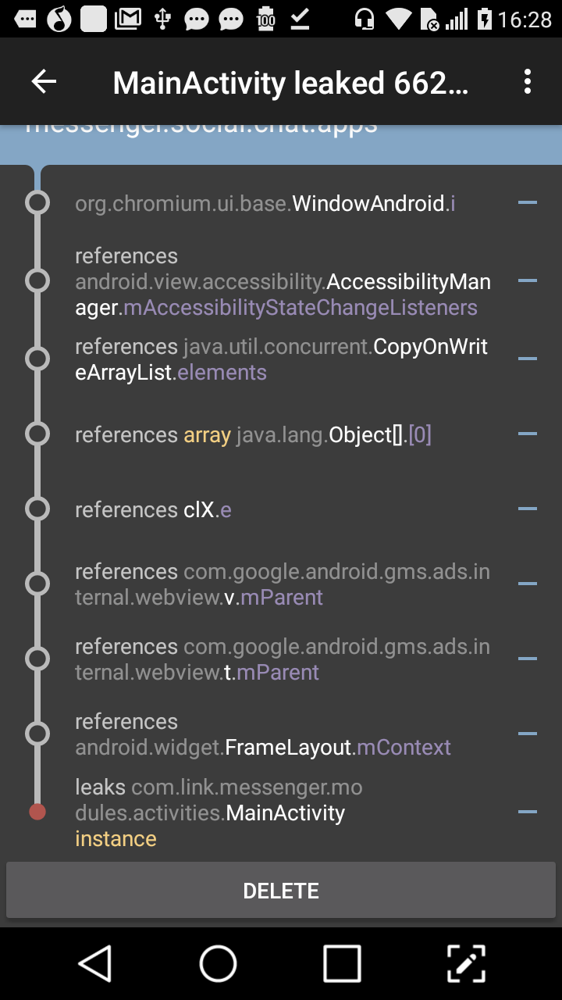
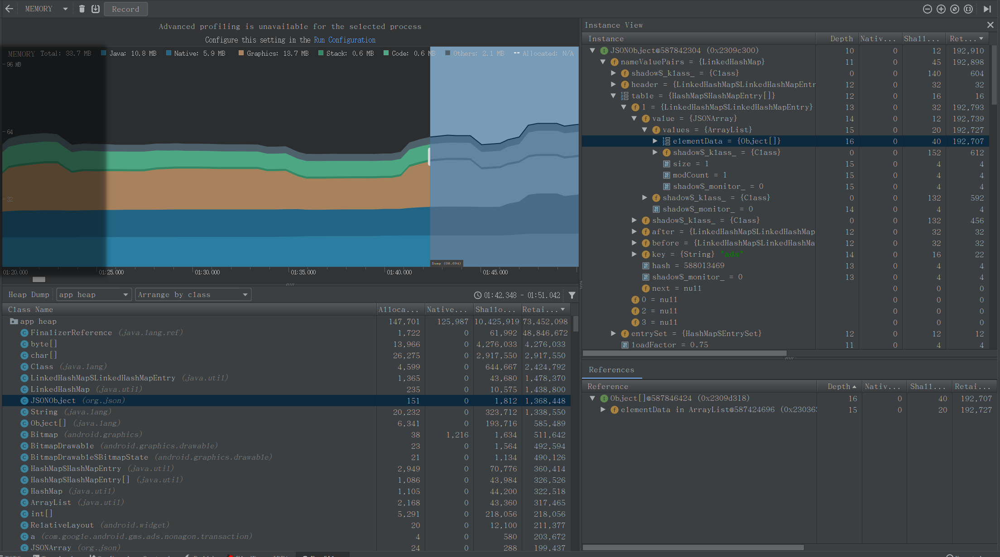
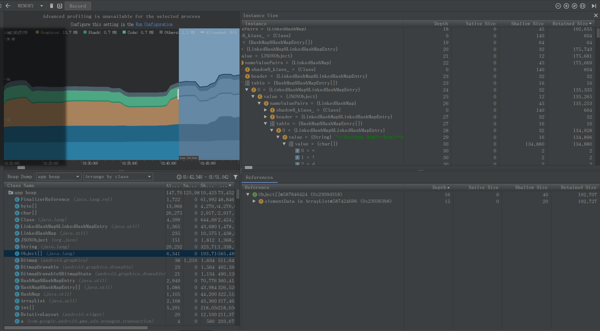

# 关于Messager的内存使用问题分析

由于该应用的activity栈并不深,主要业务集中于MainActivity中,并且对本地资源的加载与使用不多,所以不过多分析初始内存的使用情况,该应用对内存的占用平均值为58MB,使用时该值波动范围为45MB~77MB.

1.然后我们来看umeng后台中有关内存溢出的日志:

```java
java.lang.OutOfMemoryError: Failed to allocate a 130822 byte allocation with 90976 free bytes and 88KB until OOM
    at java.lang.AbstractStringBuilder.enlargeBuffer(AbstractStringBuilder.java:95)
    at java.lang.AbstractStringBuilder.append0(AbstractStringBuilder.java:133)
    at java.lang.StringBuilder.append(StringBuilder.java:124)
    at org.json.JSONStringer.string(JSONStringer.java:344)
    at org.json.JSONStringer.value(JSONStringer.java:252)
    at org.json.JSONObject.writeTo(JSONObject.java:720)
    at org.json.JSONStringer.value(JSONStringer.java:237)
    at org.json.JSONObject.writeTo(JSONObject.java:720)
    at org.json.JSONStringer.value(JSONStringer.java:237)
    at org.json.JSONObject.writeTo(JSONObject.java:720)
    at org.json.JSONStringer.value(JSONStringer.java:237)
    at org.json.JSONObject.writeTo(JSONObject.java:720)
    at org.json.JSONStringer.value(JSONStringer.java:237)
    at org.json.JSONObject.writeTo(JSONObject.java:720)
    at org.json.JSONObject.toString(JSONObject.java:689)
    at com.google.android.gms.ads.internal.webview.v.b(:com.google.android.gms.dynamite_adsdynamite@16089029@16.0.89 (020306-239467275):158)
    at com.google.android.gms.ads.internal.webview.t.b(:com.google.android.gms.dynamite_adsdynamite@16089029@16.0.89 (020306-239467275):40)
    at com.google.android.gms.ads.internal.gmsg.aj.a(:com.google.android.gms.dynamite_adsdynamite@16089029@16.0.89 (020306-239467275):43)
    at com.google.android.gms.ads.nonagon.ad.nativead.util.d.a(Unknown Source)
    at com.google.android.gms.ads.internal.util.future.k.run(Unknown Source)
    at com.google.android.gms.ads.internal.util.future.ad.execute(:com.google.android.gms.dynamite_adsdynamite@16089029@16.0.89 (020306-239467275):4)
    at com.google.android.gms.ads.internal.util.future.y.a(:com.google.android.gms.dynamite_adsdynamite@16089029@16.0.89 (020306-239467275):7)
    at com.google.android.gms.ads.internal.util.future.ah.a(:com.google.android.gms.dynamite_adsdynamite@16089029@16.0.89 (020306-239467275):5)
    at com.google.android.gms.ads.internal.util.future.h.a(:com.google.android.gms.dynamite_adsdynamite@16089029@16.0.89 (020306-239467275):6)
    at com.google.android.gms.ads.nonagon.ad.nativead.util.b.a(:com.google.android.gms.dynamite_adsdynamite@16089029@16.0.89 (020306-239467275):22)
    at com.google.android.gms.ads.nonagon.ad.nativead.p.e(:com.google.android.gms.dynamite_adsdynamite@16089029@16.0.89 (020306-239467275):206)
    at com.google.android.gms.ads.nonagon.ad.nativead.ag.run(Unknown Source)
    at android.os.Handler.handleCallback(Handler.java:739)
    at android.os.Handler.dispatchMessage(Handler.java:95)
    at zu.a(:com.google.android.gms.dynamite_adsdynamite@16089029@16.0.89 (020306-239467275):5)
    at com.google.android.gms.ads.internal.util.e.a(:com.google.android.gms.dynamite_adsdynamite@16089029@16.0.89 (020306-239467275):11)
    at zu.dispatchMessage(:com.google.android.gms.dynamite_adsdynamite@16089029@16.0.89 (020306-239467275):4)
    at android.os.Looper.loop(Looper.java:135)
    at android.app.ActivityThread.main(ActivityThread.java:5422)
    at java.lang.reflect.Method.invoke(Native Method)
    at java.lang.reflect.Method.invoke(Method.java:372)
    at com.android.internal.os.ZygoteInit$MethodAndArgsCaller.run(ZygoteInit.java:914)
    at com.android.internal.os.ZygoteInit.main(ZygoteInit.java:707)
```
    上面的日志应该是谷歌的webView广告在操作JSONObject这个对象时发生了OOM.

    然后再看leak canary 捕获到的Memory leak:


<div align="center">

</div>

     对比以上两者在webview类中的方法调用,可以发现基本上一样;那么可以进一步推断,这是Native广告中出现了webView形式的广告在调用

     资源的时候发生的.所以我们来查看一下应用正常运行时内存堆栈内其中一个JSONObject对象的情况:

<div align="center">

</div>

     可以看见它在内存中的大小为192KB,总共的JSONObject对象大小为1.3MB左右;继续看引用,可以发现主要的大小占用是为一个

     ArrayList,然后继续看这个ArrayList里是什么;  对elementData点击右键,再点"Go to Instance"

<div align="center">

</div>

    展开其中已经转换好的Value{String},可以发现里面是webView广告实现的html源码,这些应该是转换并解析完成的内容(这里面的内容非

    常简洁,及本上就是定义header,body等放置布局,但是在android上的解析却非常消耗资源).所以最后我们知道为什么该类广告如此

    地消耗内存资源,其次是OOM为什么总是发生在这个位置(这个之后说);

2.其实当前Messager要复现一些内存泄漏的问题也很简单.上面也说过,该应用的主要业务基本上都在MainActivity场景中完成.所以我

的操作步骤是用Messager打开Messager Pro,再用Messager Pro打开Messager,重复了将近10次后,可以发现messager的MainActivity中

的native广告出现2个,并且点击back后再次打开MainActivity,直到关闭重复数的MainActivity为止.该情况的原因是,由于MainActivity没有

添加singleTask的lanchmode,并且在startActivity的Intent中添加了NEW_TASK与CLEAR_TOP的FLAG,导致每次调用LanchApp的方法

就在该应用的ActivityStack中创建一个MainActivity的task.所以产生了Messager应用进程的activity的栈中有多个MainActivity的task,

并且产生了多个Native广告的实例,显示在栈最上层的MainActivity中的情况.当然,这种创建多个相同ActivityTask的例子比较极端(比如

说用pakageManager启动应用,或是分享启动应用事件等),也没有多少人会无聊地做这种操作,但是,这种方式还是有其他问题的.先来看

一段其他人的解释:


>1.单独的FLAG_ACTIVITY_NEW_TASK并不等价于启动模式 singleTask，它仅表示寻找activity所需的任务栈压入，
（即TaskAffinity指定的任务栈，TaskAffinity默认为应用包名）

>2.FLAG_ACTIVITY_NEW_TASK+FLAG_ACTIVITY_CLEAR_TOP也不等价于启动模式singleTask

>3.在FLAG_ACTIVITY_NEW_TASK+FLAG_ACTIVITY_CLEAR_TOP的情况下，AndroidManifest.xml中设置activity的启动模式为
standard或singleTask时activity入栈方式是不一样的

>>3.1当启动模式为standard时，如果activity所需的栈中已经存在该activity的实例了，那么这个实例连同它之上的activity都要出栈，
然后再新建一个activity实例入栈。

>>3.2当启动模式为singleTask时，如果activity所需的栈中已经存在该activity的实例了，那么系统会调用该实例的onNewIntent()
方法，且只将该实例之上的activity出栈。

>>3.3如果activity所需的栈中不存在该activity的实例，则不论启动模式为standard还是singleTask，都是新建activity实例直接
入栈。

>4.AndroidManifest.xml中设置activity的启动模式为singleTask时，则不论是FLAG_ACTIVITY_NEW_TASK+
FLAG_ACTIVITY_CLEAR_TOP还是只有FLAG_ACTIVITY_NEW_TASK效果一样，因为singleTask模式中默认就带有
FLAG_ACTIVITY_CLEAR_TOP标识。

作者：jiejingguo
来源：CSDN
原文：https://blog.csdn.net/jiejingguo/article/details/80511136
版权声明：本文为博主原创文章，转载请附上博文链接！

所以,另一个问题就是上述中的3.1与3.2.应用中的所有startActivity的intent都是以这种方法设置flag的,那么只要是代码唤起应用,都会把

包括MainActivtyTask在内的连同它之上的activity都出栈一次,然后新建MainActivty实例.所以光是MainActivty的生命周期全run一遍

的次数就特别多,更别说其中的方法了.而且这并不是重启应用,所以很多内存泄漏或者其他问题会在这个过程中不断积累,导致OOM.所以,

我认为这个问题修改后会导致很多问题的出现次数下降甚至不出现.   
